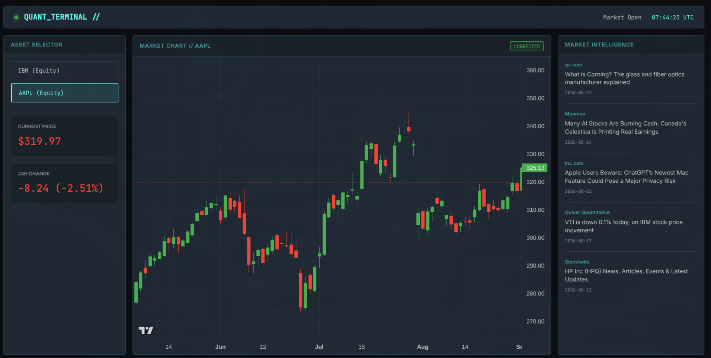

# Quant Terminal: Real-Time Financial Market Dashboard



## Overview

Quant Terminal is a production-grade, highly polished web application demonstrating complex API consumption, server-side caching, and advanced front-end data visualization. Built for the modern web, it features a bespoke financial terminal aesthetic inspired by Bloomberg Terminal, blending dark mode, sleek typography, and high-performance interactive charting.

This project was built to showcase full-stack proficiency, focusing on building resilient API integrations and crafting specialized, non-generic user interfaces.

## Key Features

- **Robust REST API Integration:** Securely consumes external financial APIs (Alpha Vantage) using Python's `requests` module, with keys kept completely isolated from the front-end via environment variables.
- **Server-Side Data Caching:** Implements `Flask-Caching` to handle strict rate limits imposed by public APIs, significantly reducing latency and ensuring high availability during API outages.
- **Advanced Error Handling:** Gracefully handles and propagates HTTP 429 (Too Many Requests), 500 (Internal Server Error), and network timeouts, providing clear visual feedback to the user.
- **Bespoke UI/UX Design:** Avoids generic templates in favor of a custom, Vanilla CSS/JS dark-mode terminal layout featuring monospaced fonts for numerical accuracy and semantic markup.
- **High-Performance Visualization:** Integrates TradingView's Lightweight Charts via Canvas API for butter-smooth time-series financial data rendering (candlestick charts).
- **PEP-484 Compliance:** Fully type-hinted Python backend architecture.

## Tech Stack

### Backend
- **Python 3.9+**
- **Flask:** Lightweight, scalable WSGI web application framework.
- **Flask-Caching:** In-memory dictionary caching (easily swappable for Redis in production).
- **Requests:** For synchronous, robust HTTP calls.
- **python-dotenv:** Secure environment variable management.

### Frontend
- **HTML5 & CSS3:** Custom grid/flexbox layout, CSS variables for theming.
- **Vanilla JavaScript:** ES6+ standards, Async/Await syntax for API consumption.
- **Lightweight Charts (TradingView):** Canvas-based financial charting library.

## Architecture

1. **Proxy Pattern:** The Flask backend acts as a secure proxy between the client and the Alpha Vantage API. The frontend never makes direct calls to the external provider, preventing API key exposure and CORS issues.
2. **Caching Strategy:** Financial data (Daily Time Series) is cached on the server for 5 minutes, and news sentiment for 10 minutes. This drastically reduces outbound network requests and abides by the standard 5 requests/minute limit on free tier APIs.
3. **Data Transformation:** The backend normalizes the deeply nested JSON payload from the provider into a streamlined array of time/OHLC objects, minimizing payload size and offloading processing overhead from the client's browser.

## Getting Started

### Prerequisites
- Python 3.9 or higher
- An Alpha Vantage API Key (Free tier is sufficient)

### Installation

1. **Clone the repository**
   ```bash
   git clone https://github.com/azeemsher788/quant-terminal.git
   cd quant-terminal
   ```

2. **Create a virtual environment**
   ```bash
   python -m venv venv
   source venv/bin/activate  # On Windows use `venv\Scripts\activate`
   ```

3. **Install dependencies**
   ```bash
   pip install -r requirements.txt
   ```

4. **Environment Setup**
   Copy the example environment file and add your API key:
   ```bash
   cp .env.example .env
   # Edit .env and replace 'demo' with your Alpha Vantage API key
   ```

5. **Run the Application**
   ```bash
   python app.py
   ```
   The application will be available at `http://localhost:5000`.

## Contact & Hire

I am actively looking for freelance clients and full-time roles requiring deep expertise in Python, API integration, and front-end data visualization. 

[Connect with me on LinkedIn](#) | [View my Portfolio](#)
